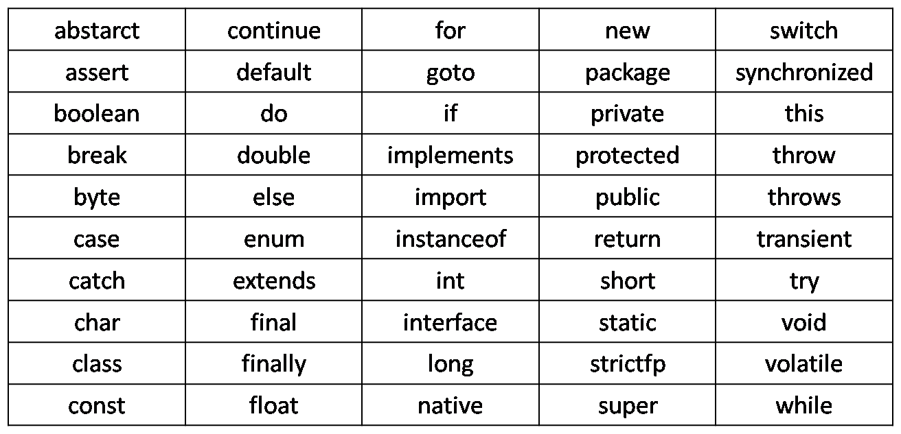

# Лабораторна робота 1: Базовий синтаксис Java

## Теоретичний матеріал

При разработке языка Java был взят за основу синтаксис языков С и C++, поэтому многие аспекты синтаксиса языка покажутся вам знакомыми.

### Комментарии

В Java, как и в C, существуют однострочные и блоковые комментарии. Однако, кроме этого, согласно конвенции Oracle, существуют другие виды комментариев: copyright-блок вверху, doc-комментарии, TODO-комментарии, комментарии после statement`ов, комментарии для комментирования кода. Ознакомьтесь с принятыми правилами использования комментариев, на защите лабораторных они будут требоваться в обязательном порядке, согласно принятым конвенциям.

```java
package ai221.ivanov;

/**
 * Это специальный комментарий для документирования (Doc comment).
 * С помощью специальной утилиты (javadoc), такие комментарии можно превратить в HTML-странички,
 * которые вместе создают документацию к вашей программе.
 * Для удобства, здесь можно использовать специальные ссылки {@link Main} и <i>HTML-тэги</i>
 */
public class Main {

    /**
     * Этот метод является "точкой входа" приложения. В проекте может быть только один метод с такой сигнатурой
     * @param args аргументы при запуске приложения
     */
    public static void main(String[] args) {

        // Это однострочный комментарий (single line comment)

        /*
         * Это комментарий в виде блока (block comment)
         */

        // TODO: это специальный TODO-комментарий. Тут можно описать, что нужно доделать на каком-то участке кода
        // FIXME: это тоже TODO-комментарий, обычно тут мелкие баги и что нужно исправить на данном участке кода

        // TODO:2022-09-03:NickGodov: дописать вывод данных в файл

        int my_variable = 5;            /* Комментарии после statement должны быть выровнены слева */
        int my_other_variable = 999;    /* с помощью табуляции */

        // Если нужно закомментировать код, то каждая строчка комментируется однострочным комментарием
//        int my_old_variable = 100;
//        int my_other_old_variable = 200;

        // Перед комментарием принято оставлять пустую строку
        int number = 924;
    }
}
```

### Переменные

Переменные чувствительны к регистру (`variable` и `Variable` – две разные переменные), могут быть бесконечной длины, состоять из букв юникода и цифр юникода, символов `_` и `$`.
Первый символ переменной может быть буквой, символом `_` или `$` (использовать _ или $ первым символом **КРАЙНЕ НЕ РЕКОМЕНДУЕТСЯ**, они существуют для специальных ситуаций, которые нас сейчас не интересуют, так что считайте, что начинаться переменная может только с буквы юникода). Крайне не рекомендуется использовать буквы национальных алфавитов, кириллицу, транслит. Только латинские буквы, названия на английском. Также, названия переменных не должны совпадать со списком зарезервированных слов, который представлен ниже.

<p align="center">
  
</p>

Кроме ключевых слов в Java существуют три литерала: `null`, `true`, `false`, не относящиеся к ключевым и зарезервированным словам, а также зарезервированное слово `var`, значение которого зависит от его позиции в коде.
Приведенный ниже блок кода даст вам общее представление о том, как надо называть переменные.

```java
int spd         = 25;   // ПЛОХО: Можно, но не рекомендуется, т.к. название не информативно
int carminspd   = 25;   // ПЛОХО: Не экономьте на названиях переменных!
int carMinSpeed = 25;   // ХОРОШО: Название переменной говорит само за себя

int s = 0; // МОЖНО: однобуквенные допускаются, только если это какие-то короткоживущие бросовые переменные

int speed = 150;    // ХОРОШО: Нормально, понятно, что переменная отвечает за скорость
int Speed = 150;    // ПЛОХО: Крайне не рекомендуется, переменные не должны начинаться с капса
int SPEED = 150;    // ПЛОХО: Крайне не рекомендуется, полностью капсом пишутся константы

const int MIN_SPEED = 25; // НЕЛЬЗЯ: в Java const не используется (хотя это зарезервированное слово)
final int MIN_SPEED = 25; // ХОРОШО: в Java для констант используется final

int моя_переменная   = 356;   // ПЛОХО: Только латиница
int DŽDžDzȯȺώϷЂ        = 145;   // ПЛОХО: Только латиница
int moya_peremennaya  = 29;    // ПЛОХО: Транслит - это полный моветон, только английский!

int $myvar = 100;   // ПЛОХО:  Теоретически можно, но НЕ РЕКОМЕНДУЕТСЯ
int _myvar = 100;   // ПЛОХО:  Теоретически можно, но НЕ РЕКОМЕНДУЕТСЯ
int 2pac   = 0;     // НЕЛЬЗЯ: с цифры начинать нельзя
int %d     = 5;     // НЕЛЬЗЯ: с других знаков начинать нельзя
int 'f'    = 5;     // НЕЛЬЗЯ: с кавычек начинать нельзя

// Если название переменной состоит из двух слов
int max_speed       = 150;  // ПЛОХО: Использовать _ для отделения слов не в константах не рекомендуется
int MaxSpeed        = 150;  // ПЛОХО: Крайне не рекомендуется, переменные не должны начинаться с заглавной буквы
int maxSpeed        = 150;  // ХОРОШО: Вот так нормально, используется lowerCamelCase
final int MAX_SPEED = 150;  // ХОРОШО: Константы пишутся капсом, каждое слово отделяется _
```

### Типы данных

В языке Java существуют примитивные типы (аналогичны типам данных в C) и ссылочные (или объектные) типы данных. На данный момент нас интересуют только примитивные типы данных.

Java – строго типизированный язык программирования. Это значит, что переменная, перед использованием, должна быть объявлена и ей должен быть присвоен тип, который нельзя поменять. Также, при  выполнении операций присваивания, компилятор проверяет соответствие типов (какого-то механизма автоматического приведения типов у Java нет).

Всего существуют восемь примитивных типов данных: `int`, `long`, `short`, `byte`, `double`, `float`, `char`, `boolean`. Их очень легко запомнить:
- 4 типа для целых чисел («короткое short», «среднее int», «длинное long» и байт);
- 2 типа для чисел с плавающей запятой (старая парочка double и float);
- 2 «специальных» типа – символ и булевый тип.

### Операторы ветвления

Операторы ветвления в C и Java практически идентичны

```java
int a = 5;
int b = 4;
int min;

// Так нужно оформлять обычный if
if (a >= b) {
    min = b;
}

// Так нужно оформлять if-else
if (a >= b) {
    min = b;
} else {
    min = a;
}

// Так нужно оформлять if-else if-else
if (a > b) {
    min = b;
} else if (a < b) {
    min = a;
} else {
    min = a;
}

// В Java используется тернарный оператор
min = (a >= b) ? b : a;

// Это равнозначно следующему выражению
if (a >=b) {
    min = b;
} else {
    min = a;
}

// Так оформляется switch
switch (a) {
    case 1:
        // что-то делаем
        break;
    case 2:
        // делаем что-то другое
        break;
    default:
        // это выполняется в том случае, если ни одно из кейсов не выполнился
}
```

### Циклы

Работа с циклами в Java мало чем отличается от языка C

```java
int progression = 0;

// Так оформляется for
for (int i=0; i < 5; i++) {
    progression +=i;
}

// ПЛОХО: так оформлять циклы не рекомендуется
for (int i=0; i < 5; i++) progression +=i;

// МОЖНО: если тело цикла состоит из одного statement'а, то можно опустить
// фигурные скобки
for (int i=0; i < 5; i++)
    progression +=i;

// Пустой for
for (int j=0; j < 10; j++);

// Так оформляется while
int iterator = 0;
while (iterator < 10) {
    // делаем что-то в цикле
    iterator++;
}

// Так оформляется do-while
int loops = 10;
do {
    // что-то делаем
    loops--;
} while (loops > 0);

// Также, в Java есть аналог foreach
int[] array = { 1, 2, 3, 4, 5 };
int sum = 0;
for(int i : array) {
    sum += i;
}

// Этот же цикл можно представить обычным for`ом
for(int i = 0; i < 5; i++) {
    sum += array[i];
}
```

### Массивы

Работа с массивами в Java несколько отличается от работы с массивами в C, в основном, из-за механизма выделения памяти под массивы.

```java
// Объявление массивов

/*
 * ХОРОШО: согласно всем соглашениям по коду и различным рекомендациям, квадратные скобки
 * ставят ПОСЛЕ ТИПА ДАННЫХ
 */
int[] goodArray;

/*
 * ПЛОХО: компилятор не выдаст ошибку, но такой синтаксис делает код менее читабельным
 */
int badArray[];

/*
 * НЕЛЬЗЯ: при объявлении массива нельзя указать его размерность.
 * Java не выделит память, пока массив не будет инициализирован
 */
int[5] anotherBadArray;

// Объявления многомерных массивов

int [][] twoDimensionalArray;
int [][][] threeDimensionalArray;

// Инициализация массивов

goodArray = new int[10];    // Инициализируем массив с 10 элементами
goodArray[0] = 15;          // Присваиваем значение первому элементу массива
goodArray[1] = 25;          // Присваиваем значение второму элементу массива

twoDimensionalArray = new int [5][4];   // Двумерный массив 5х
twoDimensionalArray[0] = new int[4];
twoDimensionalArray[1] = new int[8];    // ПЛОХО: Компилятор проглотит, но по факту выделится место всего под 4 инта
twoDimensionalArray[0][0] = 1; // Присваиваем значение
twoDimensionalArray[1][5] = 5; // НЕЛЬЗЯ: Компилятор выдаст ошибку

System.out.print(twoDimensionalArray[1][6]); // НЕЛЬЗЯ: Компилятор выдаст ошибку

// Объявление с инициализацией

int[] quickArray = {1, 2, 3 ,4};    // Объявляем и сразу заполняем данные. Компилятор выделит место под 4 инта
quickArray[5] = 6;                  // НЕЛЬЗЯ: Компилятор выдаст ошибку, т.к. индекс выходит за пределы массива

int[][] quick2DArray = {
        {1 ,2 ,3},
        {1, 3, 4}
};
```

### Методы

Так как Java является объектно-ориентированным языком, функции здесь называются методами (на данный момент мы будем считать, что методы и функции выполняют одну и ту же роль, но методы могут находиться только внутри классов).

```java
/*
 * Синтаксис функции:
 * [1-модификаторы доступа] [2-тип возвращаемого значения] [3-имя]([4-аргументы]) [5-список исключений] {
 *      6- тело функции
 * }
 *
 * 1 - модификаторы доступа: на данный момент они нас не интересует, можно ничего не писать или писать private
 * 2 - тип возвращаемого значения - тип данных либо void, если функция ничего не возвращает
 * 3 - ограничения как и на имена переменных, но есть дополнительные правила наименования, о них ниже
 * 4 - список аргументов через запятую. Например (int a, double b). Если нет аргументов - пустые скобки
 * 5 - исключение пока не рассматриваем, если их нет, то просто ничего не пишут
 * 6 - тело функции, в нем происходит выполнение функции. Если есть возвращаемый тип данных - должен быть return
 */
private int findMinimum(int a, int b) {
        int min;

        min = (a < b) ? a : b;
        return min;
        }

/*
 * Название метода начинается с маленькой буквы, если несколько слов - используется lowerCamelCase.
 * Первое слово должно быть глаголом (т.к. метод, как правило, "что-то делает"), остальные слова могут быть
 * прилагательными, существительными и тд. Символ _ крайне желательно не использовать (кроме юнит-тестов)
 */

// ХОРОШО: с маленькой буквы, первое слово - глагол
private void drawCircle() {}

// ПЛОХО: Символы $ и _ не используем
private void $er () {}

// ПЛОХО: используйте camelCase для названия методов
private void draw_circle () {}

// ПЛОХО: название метода должно начинаться с маленькой буквы
private void Draw() {}

// ПЛОХО: первое слово должно быть глаголом
private void circle() {}
```